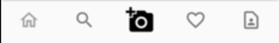

# UI-UX Documentation

## Choice and coherence of style

We decided to go with a set of color that is similar to the Instagram one.
Orange color mean youth, creativity and the sharing that is perfect with the type of our application. We are targetting young customers to share their creativity through their creations. Blue color means confidence, calm and communication. We want customers to have confidence in the application and be able to communicate easily with other users.

## Usage of space

The application is simple and airy. We do not want to overload the pages to allow a better user experience and that each element has a meaning. Each page has its own utility to prevent the user from getting lost. For example, we decided to place the navigation bar at the bottom of the page so that the user does not feel lost when coming from these other applications and feels comfortable to use the application to its fullest and that there are no habits relearn.

##  Choice of elements

Because we are doing a Flutter application, we decided to go with the Material Design from Google. That mean that all icon, typographie and elements like buttons or bottom bar are from Material Design.
