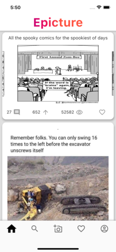
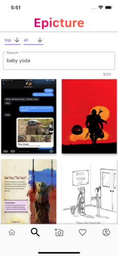
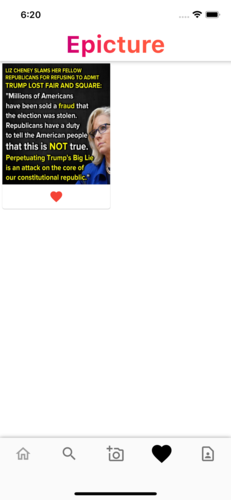

# User Documentation

## Register / Login

You can register or login thanks to the imgur interface.

## Feed

The feed is the main page of the application. It displays the most viral imgur post without nsfw content. You can favorite pictures by clicking on the heart below the image. You can see the number of comment and vote up/down the post.
By clicking the picture, you'll be redirected to its specific page.

## Picture

This is the specific page of the picture, that seems that you can see all of its comment and comment it. You still can favorite and up/down vote the image like in the feed page.

## Search

You can search posts by name. You can click on the picture and it will redirect you to its specific page.

## Upload

In this page, you can upload picture to imgur. You can either pick it from your gallery or take one directly with your device.

## Favorite

This is the favorite page. All pictures that you added to your favorites are displayed in this page.

## Profile

This is the profile page. You can see all your profile informations like your score, reputation, name description and avatar. You can edit your username and your description. Pictures that you uploaded are display below your profile informations.

